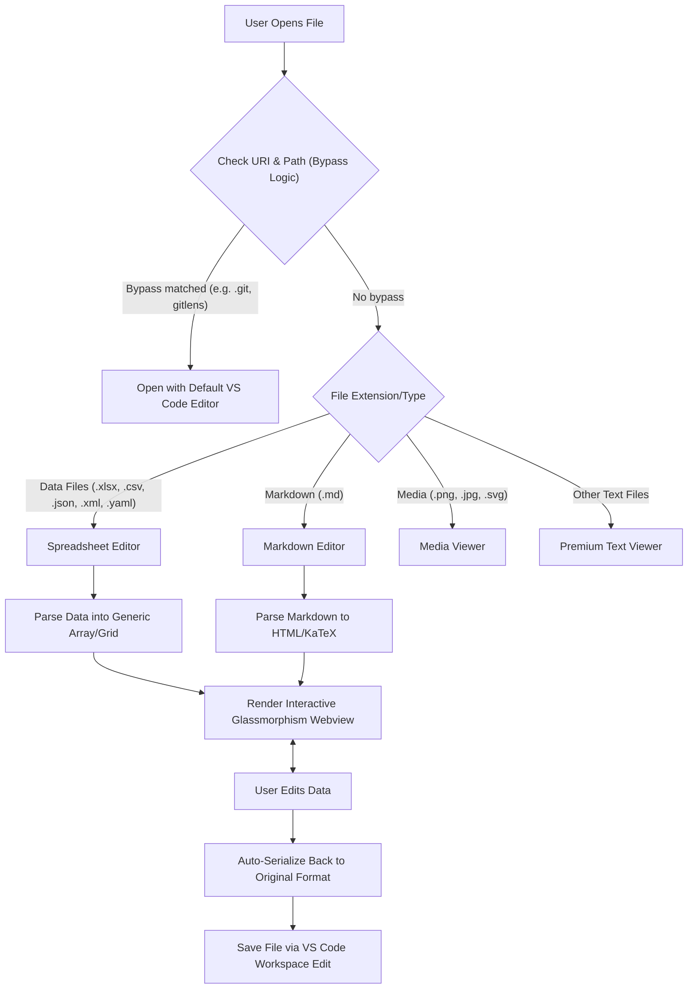

# Universal File Editor (XLSX, CSV, Markdown, JSON, XML, YAML)

Transform VS Code into a powerful, unified workspace for viewing and editing **any** file format with a premium, glassmorphism-styled interface.

## 🚀 Key Features

### 📊 Unified Spreadsheet & Structured Data Editor

Supports **XLSX, CSV, TSV, JSON, JSONL, XML, and YAML** with a single, high-performance editing pipeline.

- **Google Sheets-style Experience**: Intuitive grid editing with support for complex data structures.
- **Native Undo/Redo (Ctrl+Z)**: Full integration with VS Code's native undo stack.
- **Large File Virtualization**: Smoothly handle massive datasets with 100k+ rows.
- **Auto-Serialization**: Automatically saves changes back to the source format (e.g., converts grid edits back to valid XML or YAML).

### 📝 Interactive Markdown Editor

- **Visual Preview Editing**: Edit your Markdown directly in the preview window with `contenteditable` support.
- **Bi-directional Sync**: Changes in the preview are instantly converted back to Markdown source.
- **KaTex & Math support**: Render complex mathematical formulas beautifully.

### 🖼️ Universal Media Viewer

- **High-Fidelity Previews**: Support for `.svg`, `.png`, `.jpg`, `.jpeg`, `.gif`, `.webp`, `.bmp`, and `.ico`.
- **Integrated View**: Media files open directly in a clean, focused viewer.

### 💎 Premium Text Fallback

- **Glassmorphism Design**: A stunning, translucent interface for all other file types (`.txt`, `.log`, `.conf`, `.env`, etc.).
- **Enhanced Readability**: Optimized typography and spacing for developer logs and configuration files.

## 🔄 Architecture & Flow Diagram

Here is a high-level overview of how the Universal File Editor processes files seamlessly within VS Code:

## 🛠️ Usage

This extension is set as the **default editor** for all supported formats. Simply click a file in the explorer to open it in the Universal Editor.

- To use the standard text editor, right-click and select **"Open With -> Text Editor"**.

### ⚙️ Customization & Git/Folder Bypassing

By default, the custom editors will automatically bypass Git-related tracking files/schemes (like `git://`, `gitlens://`, `vscode-local-history://` etc.) and files inside `.git` or `node_modules` folders, reverting to VS Code's standard text editor so that source control tracking and diff comparison views work perfectly.

You can customize this behavior in VS Code settings:

- `xlsxViewer.disableTextViewer` (default: `false`): Set to `true` to completely disable the Premium Text Viewer custom editor (so that all standard text/log files open in the native text editor).
- `xlsxViewer.excludeSchemes` (default: `["git", "gitlens", "gitlens-git", "gitfs", "vscode-local-history", "pr", "review"]`): Excludes specific URI schemes from opening in custom editors.
- `xlsxViewer.excludePaths` (default: `["**/.git/**", "**/node_modules/**"]`): Glob patterns/path substrings to exclude.

## 💖 Support the Developer

If you find this extension helpful and it saves you time, please consider supporting its development!

- **UPI ID**: `vallarasuk143@pingpay`

Thank you for your support!

## 🛠️ Recent Fixes (v1.0.9)

- **Fix Webview Loading Issues**: Resolved a perpetual "loading" state when opening Markdown and Spreadsheet editors by correcting the VS Code API instantiation.
- **Improved Error Logging**: Error diagnostics are now forwarded from the webview context to VS Code notification windows.

## 📜 License

MIT
